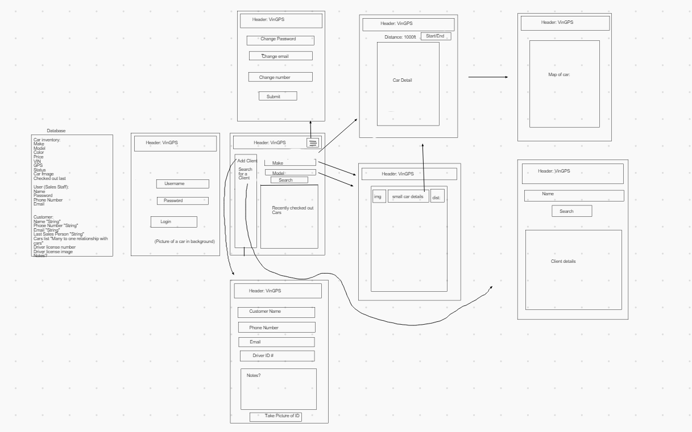

# VinGPS

## Team Lucky Charms: Garhett Morgan, Kamit Satkeev, Peyton Cysewski, Marchael Acode

**Author**: Garhett Morgan, Kamit Satkeev, Peyton Cysewski, Marchael Acode

**Version**: 1.0.0 (increment the patch/fix version number if you make more commits past your first submission)

## Overview

- Android application that grabs vehicle data from a dealership API and displays the exact location of the car. This application will solve the real world problem for car sales staff having to locate cars on ancillary lots while their clients wait countless minutes for them to return. This app will allow verified users to access a dealership database of inventory and locate the last known location of the vehicle to easily point the sales staff to that location drastically reducing the wait time and improving overall customer experience.

## Team Agreement

- [VinGPS Team Agreement](https://docs.google.com/document/d/1mITXGovoBX7bvndnoVaBS5nt5kE_bOTTxj5RWHP-tgA/edit?usp=sharing)

## User Stories

- User Story:
    - As a user, I would like to be able to access a database that I can pull vehicle information from and display on the app.
    - Feature Tasks:
        - Create Database using Amplify DynamoDB / Google Firebase Cloud Store
        - Populate Database with "dummy" data.
        - Database should have three tables, one should have a bunch of cars, another should have users data, the last should track client data.

- User Story:
    - As a user, I would like to be able create and update a new user to the application, as well as, sign in.
    - Feature Tasks:
        - Create a "sign up" activity to create a new user in the database that takes in user data.
        - Create activity for "sign in" so that the user can only see the client data that he enters into the system.
        - Create "update" activity so a user can update passwords, names etc.

- User Story:
    - As a user, I would like to be able to create a new "client" to add to the database.
    - Feature Tasks:
        - Add client data.
        - Add time and date of arrival
        - Add which user they interacted with last
        - Add notes about what they are interested in.

- User Story:
    - As a user, I would like to search for an individual car in our inventory using a VIN and access its data.
    - Feature Tasks:
        - Create an activity that shows the car's location on a real world map of the planet.
        - I would like to see the distance to the car on the screen.
        - This activity will also show vehicle details, VIN, Color, Doors etc.

- User Story:
    - As a user, I would like to be able to "test drive" the car, and update the database so that other users will be notified if they search for the same car. Also, I would like to end the test drive as well.
    - Feature Tasks:
        - Button should appear on the same activity as the car details page. When clicked, this button will update the database showing it's not available.
        - If the button is clicked and the car is already on a test drive, I would like to be notified as a user that I can't check this out right now.
        - Button that ends the test drive will automatically update the car location in the database.

- User Story:
    - As a user, I would like to see a feed (real time, or most recent list) of cars recently "checked out"
    - Feature Tasks:
        - List should return a small detail fragment of each car checked out.
        - List should appear on main activity.

- User Story:
    - As a user, I would like to search by make and model (or other things if possible), and populate a list of vehicles matching the description.
    - Feature Tasks:
        - List should include small detail fragments of the car as well as pictures.
        - List items should also include the distance away from the user.
        - If a user clicks on the individual car, the individual car detail page listed above would show.

- User Story:
    - As a user, I would like to search for a "client" and bring back their test drive history.
    - Feature Tasks:
        - Display list of cars (small fragments) on the page to show what I've shown them.

- User Story:
    - As a user, as a part of creating a new client, I would like to scan their ID and attach it to a "legal" liability waiver form.
    - Feature Tasks:
        - Use android built in tools to take a picture of an ID and update it to the client database.

- User Story:
    - As a user, I would like to see the last user that checked out a car
    - Feature Tasks:
        - Update the vehicle database to show which user checked out that car by the specific user.

## Software Requirements

- [VinGPS Software Requirements](https://docs.google.com/document/d/1etLSVdYfMMCn5PTMXQaXltzb6-wHKrDqrVHiAT-plms/edit?usp=sharing)

## Wireframes / Domain Modeling Diagram

- 

## Data Entity Relationship Diagram

- 

## Credit and Collaboration

- [Scrollable Screen](https://www.youtube.com/watch?v=DpFNfQzhKQM)

- [Navigation Drawer - Menu](https://www.youtube.com/watch?v=fGcMLu1GJEc&t=424s)

- [Navigation Drawer - Layout and Hamburger](https://www.youtube.com/watch?v=zYVEMCiDcmY)

- [Navigation Drawer - Handling Menu Items](https://www.youtube.com/watch?v=bjYstsO1PgI)

- [Show and Hide Buttons](https://stackoverflow.com/questions/6173400/how-to-hide-a-button-programmatically)
